# Agent — 快速上手

**Agent** 可以把你想做的事，自动拆成一系列步骤，并在目标设备上执行 —— 当前实现，通过 SSH（终端模式），或者通过无线键盘（HID 模式）。

你只需要用自然语言描述任务，Agent 会规划步骤、等你确认、然后执行。

---

## 1. 开始前的准备

Agent 工作前需要配置三件事：

### A. AI 供应商配置

> 配置流程：启用 AI 功能 → 选择供应商 → 配置 API Key → 测试连接 → 返回 Agent

1. 打开 Agent 界面。如果看到 **"Connect AI"** 引导页，点击它下方的按钮(Use my API key)跳转到Setting AI界面。

* **操作例图（按下Use my API + Enable AI features）**

  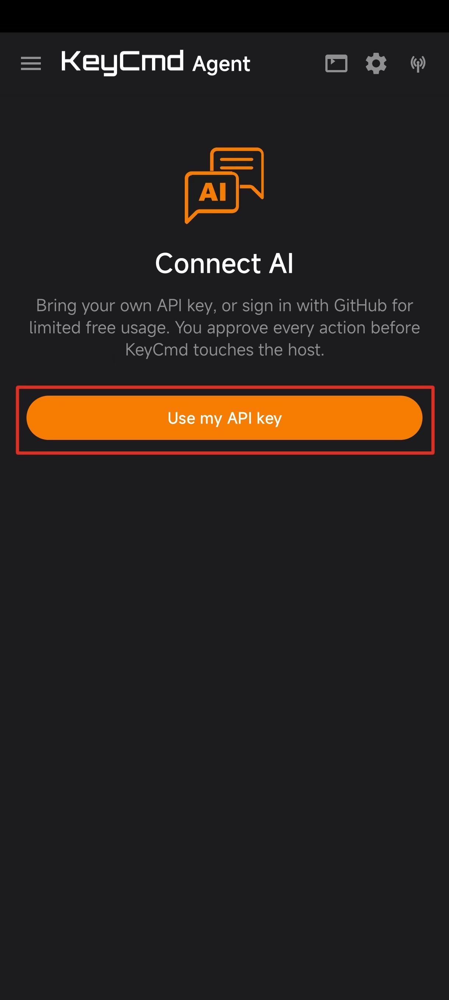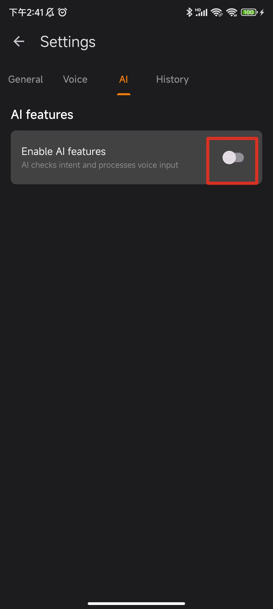

AI features初始默认是关闭的，启用后，切出配置界面。

开始设置并选择一个 AI 供应商（OpenAI、Anthropic、Google、DeepSeek 等），填入 API Key 和 Endpoint（URL），或者添加第三方的AI 供应商。

1. 按下AI Provider Setting配置选项右上的**下拉**图标打开Select AI Provider。

   > 初次使用时，预设供应商都未配置 API Key。

* **操作例图（AI Provider Setting + Select AI Provider）**

  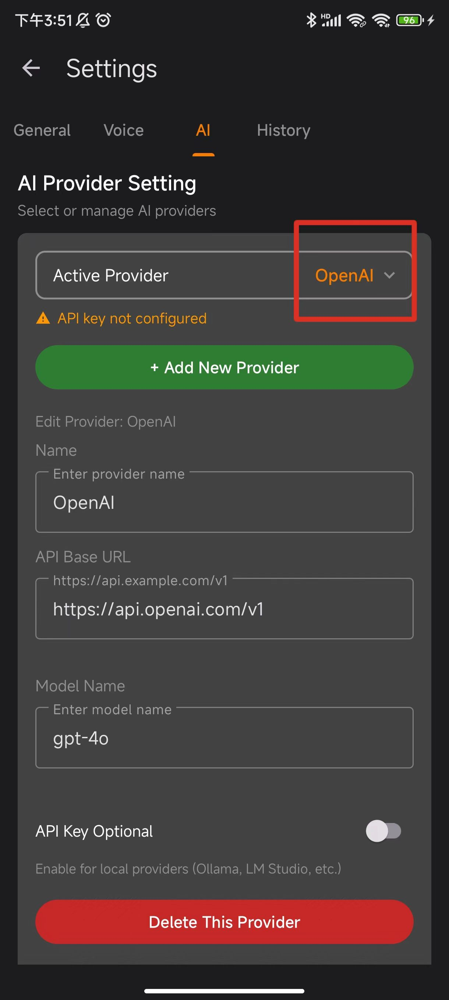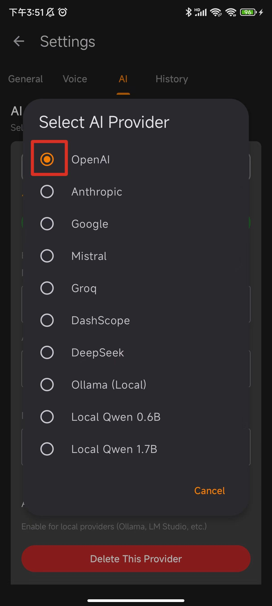

> 支持本地供应商（Ollama、Local Qwen)—— 它们的 API Key 字段可以留空。

如果需要添加新的供应商，操作如下:

1. 点击绿色 **Add New Provider** 按钮
2. 在弹出窗口中确认，再次点击 **Add Provider**

* **操作例图（按下Add New Provider，再次确认Add Provider)**

  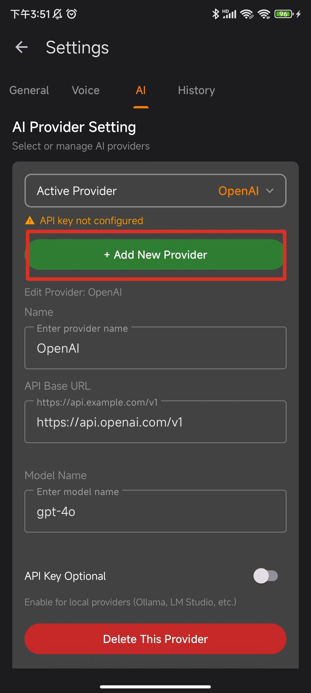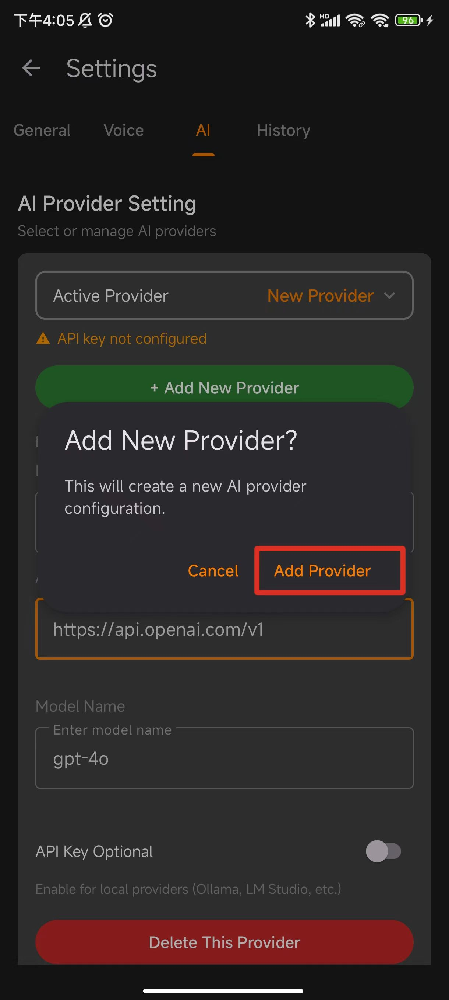

如何配置新的Provider:

1. 填入供应商命名（命名可以自定）、API Base URL、Model Name三个基础选项。
2. 选择是否启用API Key Optional（根据供应商实际情况自主选择）。

* **操作例图（填入三项基础信息+是否启用API key Optional）**

  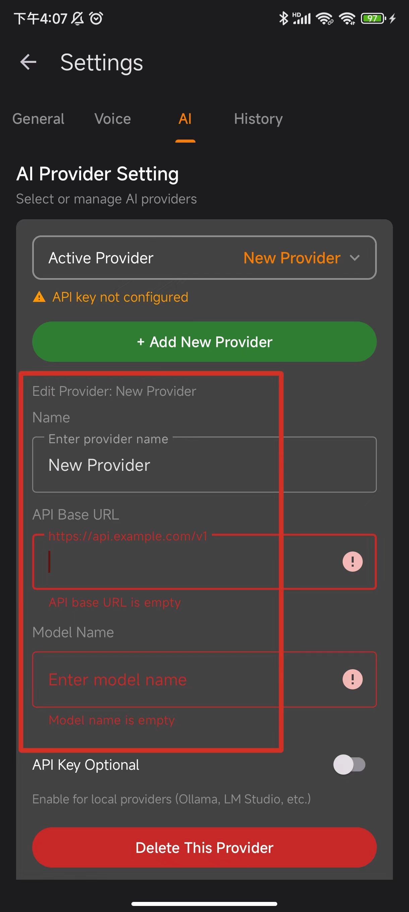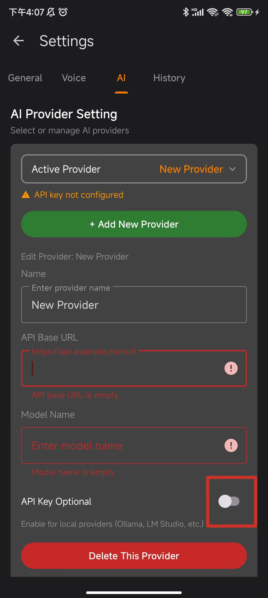

配置完成后，根据供应商的实际需求，选择是否设置 API Key（本地供应商如 Ollama 可以留空）。以下是设置 API Key 的操作步骤：

1. 选择供应商后，滑动到下方的API Key Management选项，按下update API Key按钮，弹出配置。
2. 在弹出的输入框中粘贴 API Key，点击 **Save key** 按钮保存。
3. 后续有变化可点击Clear Key清除密钥。

* **操作例图（按下update API Key + 粘贴 API Key并且保存）**

  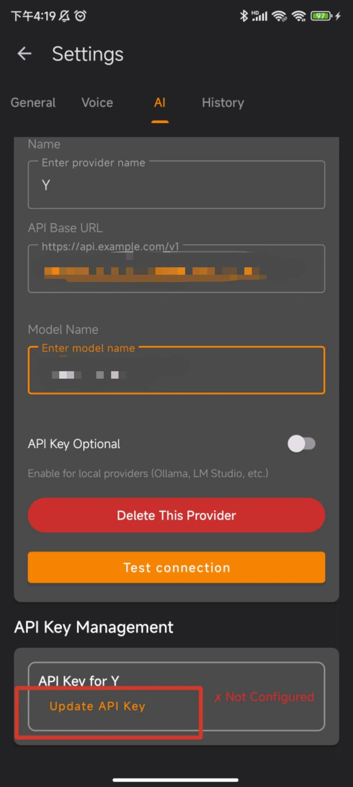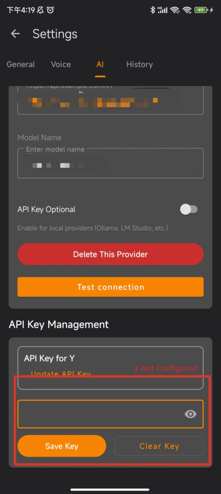

在一切配置完毕后，可选如下操作：

1. 点击 **Test connection** 按钮，测试 AI 配置是否连接成功。连接成功后会显示绿色提示。
2. 返回 Agent 界面，此时已自动切换到对话模式。

* **操作例图（按下 Test connection 按钮 + 成功提示）**

  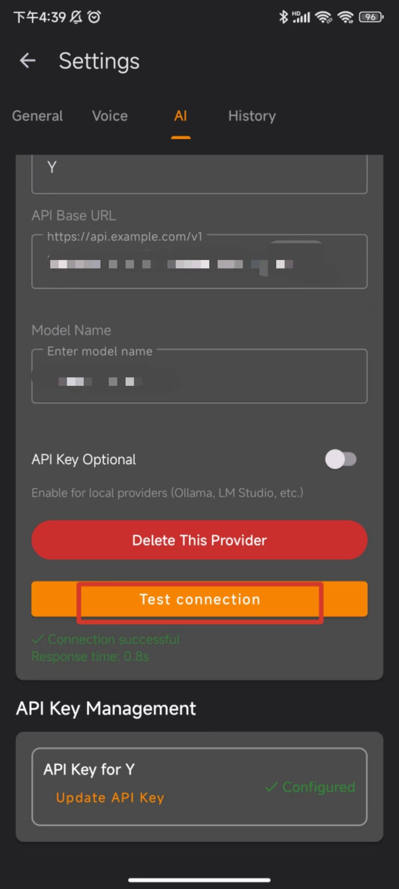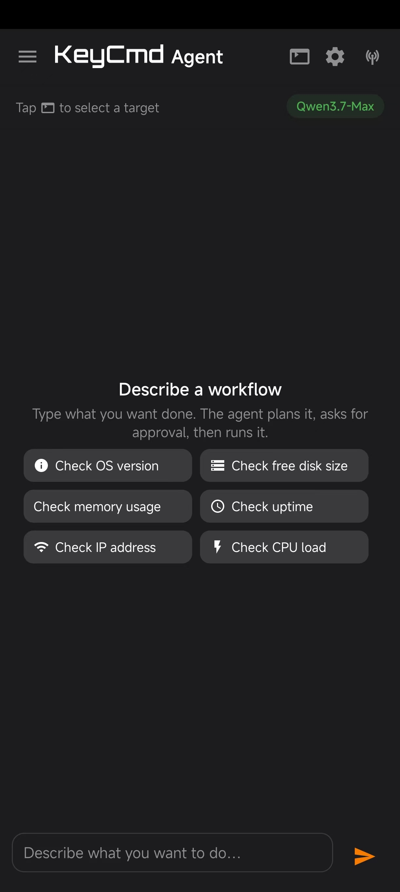
  
  > 如果测试失败，请检查：API Key 是否正确、Endpoint URL 是否完整、网络连接是否正常。

### B. Target Setting配置 

点击顶部的 **目标图标** 🎯，选择其一：

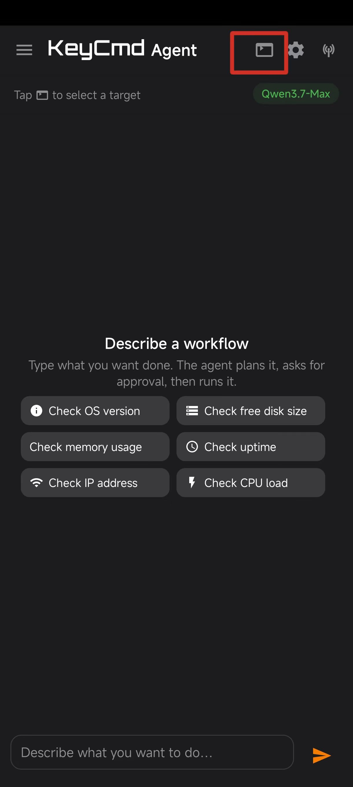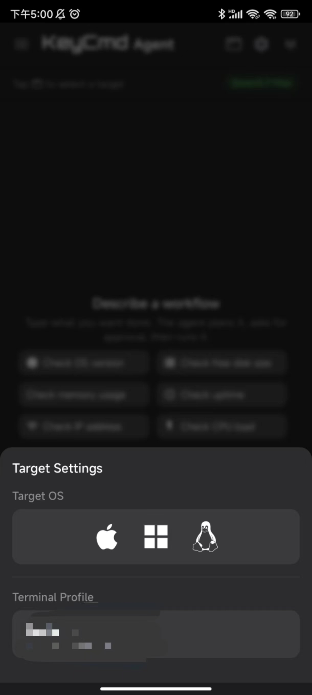

| 选择 | 进入模式 | 行为 |
|---|---|---|
| 同时指定 SSH Profile 和目标 OS | **终端模式** | Agent 会生成匹配远端系统的命令，通过 SSH 执行命令，并捕获输出。 |
| 仅选择目标 OS（macOS / Windows / Linux） | **HID 模式** | 通过 BLE 键盘在目标的活动窗口中输入按键。**不会**捕获输出。 |

> Terminal Profile的配置对应终端SSH连接配置。

### C. Agent Setting配置

点击顶部的 **设置图标**，逐项配置：

1. **AI Provider**选项配置当前Agent调用的AI配置。
2. **Execution Limits** 配置计划的生成限制，生成、执行失败时候的最大重试限制次数。
3. **System Prompts** 可自定义终端模式和 HID 模式的系统提示词（高级用户）。

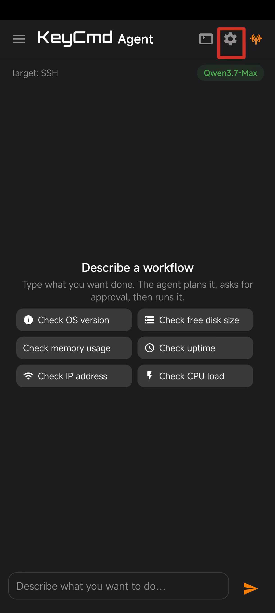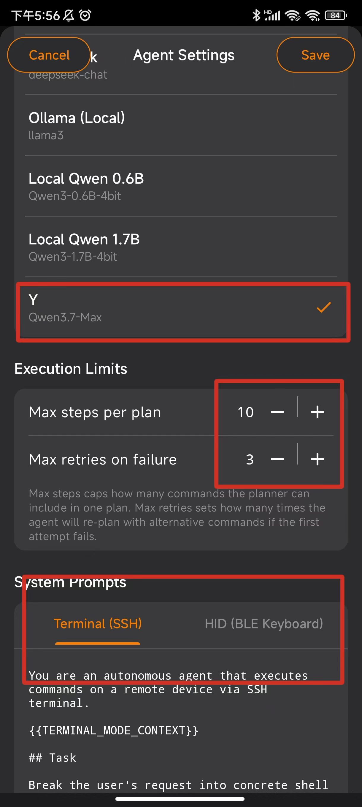

---

## 2. 完成你的第一个任务

### 步骤 1 — 描述你想做什么

在输入框中输入请求，点击 **发送**。

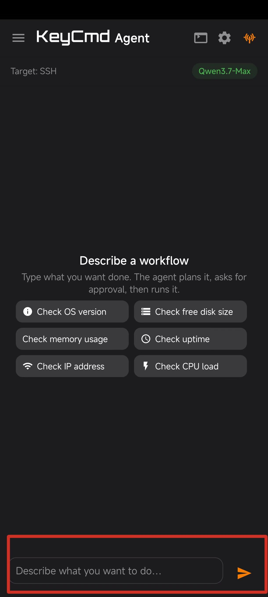

示例提示词：

- `"检查电脑当前状态"`
- `"显示占用 CPU 最高的前 10 个进程"`
- `"打开浏览器并访问 example.com"`（HID 模式）
- `"保存当前文件并切换到下一个标签页"`（HID 模式）

Agent 思考时你会看到 "Thinking..." ，可能需要几秒钟。

### 步骤 2 — 审核计划

计划就绪后，Agent 会用一张卡片列出所有步骤：你有三种选择：

-  **批准（Approve & Run）** —— 按原样执行计划。
-  **编辑（Edit）** —— 修改、添加或删除步骤后再执行。
-  **取消（Cancel）** —— 丢弃该计划。

> 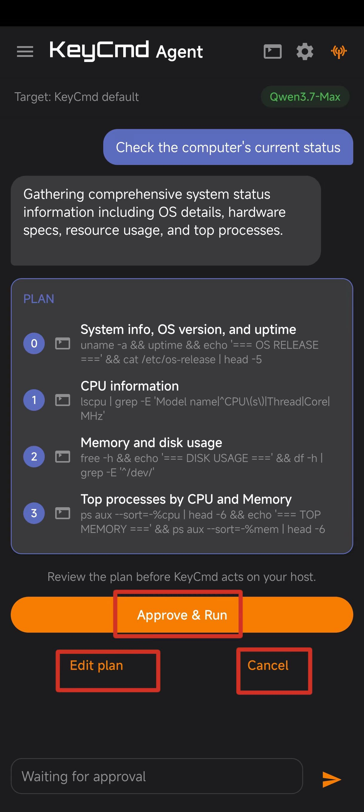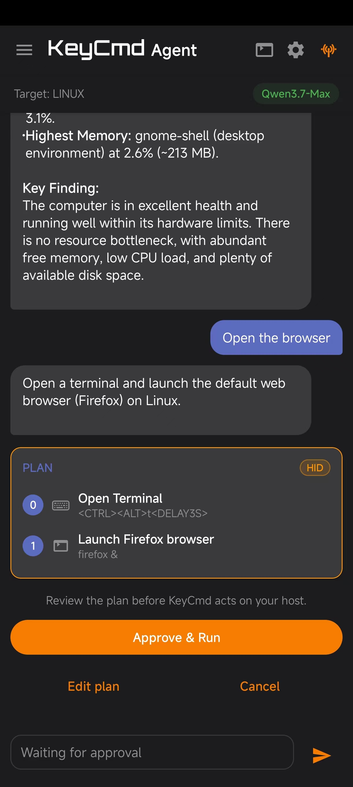
> **未经批准，什么也不会执行。** Agent 绝不会自行运行任何命令。
>
> 生成HID命令时，计划卡片会有HID标记

### 步骤 3 — 观看执行过程

每个步骤会以卡片形式出现，显示实时输出（终端模式）或状态行（HID 模式）。全部完成后，Agent 会发一条简短的总结。结束后，你可以立刻输入下一个请求。

* 执行过程 + Agent总结

  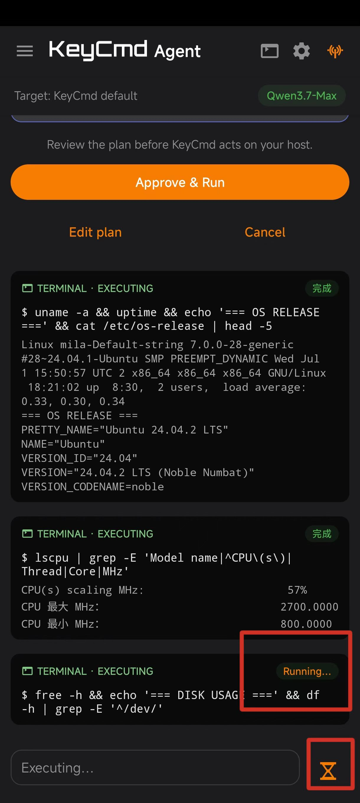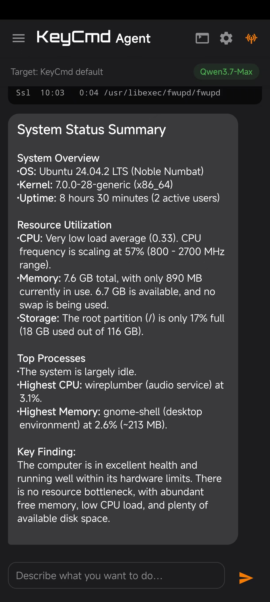

  > 实时运行的终端会提示当前命令执行状态，点击沙漏图标可中止当前Agent的执行

---

## 3. 示例提示词

### 终端模式（SSH）

| 你输入 | Agent 会做什么 |
|---|---|
| `"找出我家目录下最大的文件"` | 运行 `find` + `du`，排序并汇总 |
| `"重启 nginx 服务"` | 运行 `sudo systemctl restart nginx`（如果允许） |
| `"显示 80 端口被谁占用"` | 运行 `ss -tulpn \| grep :80` 或类似命令 |
| `"清理 7 天前的旧日志"` | 计划执行 `find /var/log -mtime +7 -delete`（请仔细审核！） |

### HID 模式（BLE 键盘）

| 你输入 | Agent 会做什么 |
|---|---|
| `"打开终端"` | 发送对应系统的快捷键（macOS: Cmd+Space，Linux: Ctrl+Alt+T，Windows: Win+R `cmd`） |
| `"保存文件并关闭标签页"` | 发送 Cmd+S / Ctrl+S，然后 Cmd+W / Ctrl+W |
| `"切换到第二个桌面"` | 发送对应系统的虚拟桌面切换快捷键 |

---

## 4. 安全机制

Agent 默认就有完善的安全防护：

- **审批关卡。** 任何命令运行前，计划都会先展示给你。

- **危险命令被拦截。** `rm -rf /`、`mkfs`、fork 炸弹等已知破坏性命令会被直接拒绝 —— 即便后台AI给出这些建议。

- **OS 错配会被识别。** 如果 Agent 给 Windows 目标生成了 Linux 命令，会在执行前被标记并拦截。

- **SSH 凭据被遮蔽。** 你的用户名、主机、端口**不会**被发送给第三方 AI 供应商。

- **随时可以取消。** 点击输入框的沙漏按钮即可停止正在运行的计划。

  > 被标记为 *dangerous*（危险）的命令（如 `rm`、`shutdown`）不会被自动拦截，但你会在计划卡片中清晰地看到它们，再决定是否批准。

---

## 5. 常见问题

**Q：Agent 提示 "No target configured"（未配置目标）。**
A：点击顶部的目标图标 🎯，选择 SSH Profile 或目标 OS。

**Q：Agent 总是给我的 OS 生成错误的命令。**
A：打开目标设置，明确选择你的 OS。Agent 会优先使用你的选择，而非自动检测结果。

**Q：Agent 返回错误并显示 "Retry"（重试）按钮。**
A：点击 **Retry** 重新生成计划。如果反复失败，请检查 AI 供应商的 API Key 和配额。

**Q：某个步骤显示为灰色的 "Retried"（已重试）。**
A：该步骤原本失败了，但 Agent 已经自动生成了替代命令并成功执行。无需额外操作。

**Q：HID 模式下无法捕获输出。**
A：这是设计如此 —— HID 模式只在活动窗口中输入按键。如果需要读取命令输出，请使用终端模式（SSH）。

**Q：可以用本地模型代替云 API 吗？**
A：可以。在设置中添加 Ollama 或 Local Qwen 供应商，API Key 字段可以留空。

---

## 6. 下一步

熟悉基础之后，你还可以：

- **自定义 Agent。** 点击设置图标，调整最大步骤数、最大重试次数，甚至编辑系统提示词。
- **执行前编辑计划。** 在计划卡片上点击 **Edit plan** 修改单个步骤。
- **随时切换目标。** **目标图标** 允许你在两次请求之间更换 OS 或 SSH Profile。

